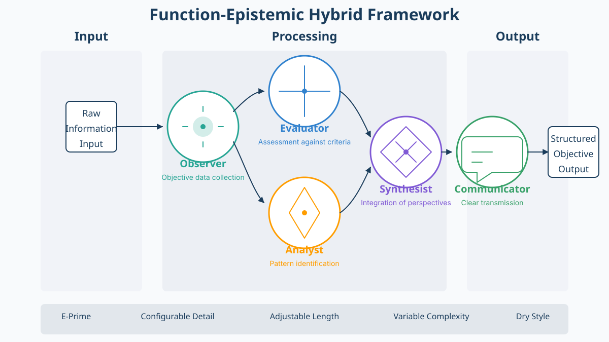

<!--
Fair Witness Bot Framework
Copyright (c) 2025 Fair Witness Bot

This work is licensed under a Creative Commons Attribution-ShareAlike 4.0
International License (CC BY-SA 4.0).
https://creativecommons.org/licenses/by-sa/4.0/
-->

# Fair Witness Bot

[](https://astro.build)
[](https://tailwindcss.com)
[](https://pages.cloudflare.com)
[](https://creativecommons.org/licenses/by-sa/4.0/)

An educational website for implementing the Function-Epistemic Hybrid Framework for structured, objective LLM interactions. This project enables objective, methodical approaches to AI interactions inspired by Heinlein's Fair Witness concept.



## What This Project Offers

The Fair Witness Bot project provides:

- **Educational Resources**: Comprehensive documentation explaining the Function-Epistemic Hybrid Framework
- **Implementation Guides**: Step-by-step instructions for various LLM platforms (OpenAI, Anthropic, etc.)
- **Interactive Examples**: Progressive examples demonstrating framework applications
- **YAML Configuration**: Ready-to-use configuration templates for immediate implementation

## The Function-Epistemic Hybrid Framework

This framework structures AI interactions through five distinct epistemic functions:

- **Observer**: Objective data collection without interpretation
- **Evaluator**: Assessment against explicit criteria
- **Analyst**: Identification of patterns and relationships
- **Synthesist**: Integration of perspectives into cohesive models
- **Communicator**: Clear transmission of findings

The framework employs E-Prime language style with configurable detail level, length, and complexity parameters.

## Getting Started

### Prerequisites

- Node.js 18 or higher
- npm or yarn

### Installation

```bash
# Clone the repository
git clone https://github.com/yourusername/fairwitness-bot.git
cd fairwitness-bot

# Install dependencies
npm install

# Start development server
npm run dev
```

The development server will start at `http://localhost:4321`.

### Building for Production

```bash
# Build the site
npm run build

# Preview the build
npm run preview
```

## Deployment

This project includes configuration for deployment to Cloudflare Pages. See the [DEPLOYMENT.md](DEPLOYMENT.md) file for complete instructions.

## Asset Generation

The project includes scripts for generating production-ready assets:

```bash
# Generate favicons
./scripts/generate-favicons.sh

# Create Open Graph images
./scripts/generate-og-images.sh

# Optimize all assets for production
./scripts/optimize-assets.sh
```

## Project Structure

```
├── public/           # Static assets
├── scripts/          # Asset generation scripts
├── src/
│   ├── components/   # Reusable Astro components
│   ├── layouts/      # Page layouts
│   ├── pages/        # Page components/routes
│   └── styles/       # Global styles
├── DEPLOYMENT.md     # Deployment instructions
├── fair_witness_config.yaml  # Core framework configuration
└── pages.toml       # Cloudflare Pages configuration
```

## Contributing

Contributions follow these guidelines:

1. Fork the repository
2. Create a feature branch (`git checkout -b feature/amazing-feature`)
3. Commit your changes (`git commit -m 'Add some amazing feature'`)
4. Push to the branch (`git push origin feature/amazing-feature`)
5. Open a Pull Request

Please follow the [Function-Epistemic Framework](https://fairwitness.bot/framework) principles in all contributions, maintaining objective analysis and E-Prime language where appropriate.

## License

This project operates under the Creative Commons Attribution-ShareAlike 4.0 International License - see the [LICENSE](LICENSE) file for details.

This means you may:
- Share — copy and redistribute the material in any medium or format
- Adapt — remix, transform, and build upon the material for any purpose, even commercially

Under the following terms:
- Attribution — You must give appropriate credit, provide a link to the license, and indicate if changes were made.
- ShareAlike — If you remix, transform, or build upon the material, you must distribute your contributions under the same license as the original.

## Acknowledgments

- Robert A. Heinlein for the Fair Witness concept in "Stranger in a Strange Land"
- The open source community for tools and frameworks
